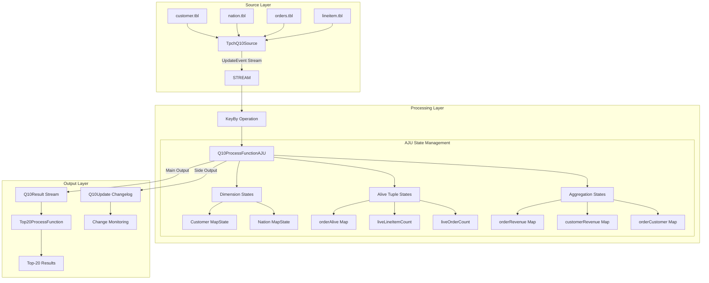
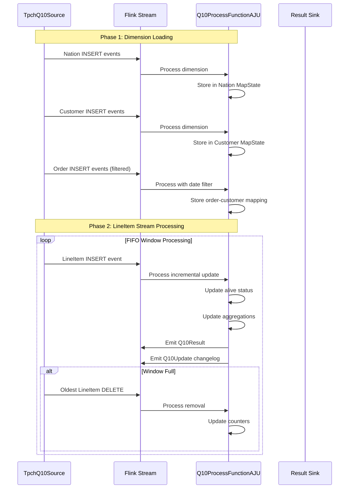
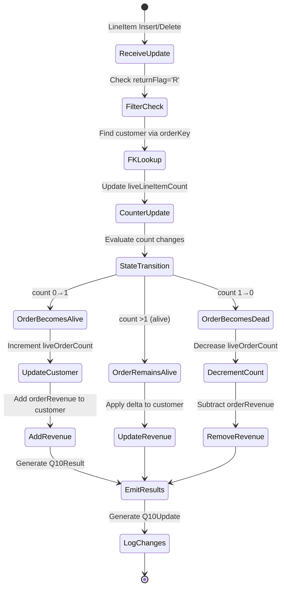
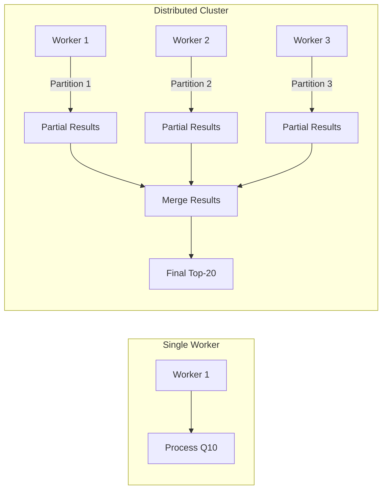

# TPC-H Query 10 - AJU Implementation

## Table of Contents
1. [Overview](#overview)
2. [Architecture](#architecture)
3. [Data Flow](#data-flow)
4. [AJU Algorithm Implementation](#aju-algorithm-implementation)
5. [Data Generation Process](#data-generation-process)
6. [Performance Characteristics](#performance-characteristics)
7. [Usage Guide](#usage-guide)
8. [Technical Details](#technical-details)

## Overview

This project implements **TPC-H Query 10** using the **AJU (Acyclic Join under Updates)** algorithm, based on the SIGMOD 2020 paper "Maintaining Acyclic Foreign-Key Joins under Updates". The system provides incremental maintenance of query results with constant-delay enumeration under arbitrary updates.

### Key Features
- **Incremental Processing**: Only processes changes (deltas) instead of recomputing entire results
- **Constant-Delay Enumeration**: Immediate access to query results after updates
- **Distributed Execution**: Built on Apache Flink for scalability and fault tolerance
- **Theoretical Guarantees**: Update complexity depends on enclosures measure (λ)

## Architecture

### System Architecture Diagram



### Component Structure

```
src/main/java/q10/
├── model/                    # Data models
│   ├── Customer.java        # Customer dimension
│   ├── LineItem.java        # LineItem fact table
│   ├── Nation.java          # Nation dimension
│   ├── Order.java           # Order dimension
│   ├── Q10Result.java       # Final query result
│   ├── Q10Update.java       # Delta changelog record
│   └── UpdateEvent.java     # Generic update wrapper
├── process/                 # Processing logic
│   ├── Q10ProcessFunctionAJU.java      # Core AJU implementation
│   ├── Top20ProcessFunction.java       # Top-20 ranking
│   └── Top20ProcessFunction3att.java   # Alternative implementation
├── sink/                    # Output handlers
│   └── OutputTop20.java     # Top-20 result formatting
├── source/                  # Data sources
│   └── TpchQ10Source.java   # TPC-H data generator
└── state/                   # State management
    ├── CustomersState.java  # Customer state
    ├── LineItemState.java   # LineItem state
    ├── OrderState.java      # Order state
    └── Q10JobAJU.java       # Main job coordinator
```

## Data Flow

### Processing Pipeline



### Update Processing State Machine



## AJU Algorithm Implementation

### Core Concepts

1. **Alive Tuples**: Tuples that can produce join results
2. **Foreign Key Acyclic Schema**: Exploits acyclic foreign-key relationships in TPC-H
3. **Enclosures (λ)**: Measure of update sequence complexity
4. **Incremental Maintenance**: Only process deltas, not full recomputation

### State Variables in Q10ProcessFunctionAJU

| State Variable | Type | Description |
|---------------|------|-------------|
| `customers` | `MapState<Long, Customer>` | Customer dimension table |
| `nations` | `MapState<Long, Nation>` | Nation dimension table |
| `orderCustomer` | `MapState<Long, Long>` | orderKey → custKey mapping |
| `orderRevenue` | `MapState<Long, Double>` | Revenue per order |
| `orderAlive` | `MapState<Long, Boolean>` | Whether order can produce results |
| `liveLineItemCount` | `MapState<Long, Integer>` | Count of qualifying lineitems per order |
| `liveOrderCount` | `MapState<Long, Integer>` | Count of alive orders per customer |
| `customerRevenue` | `MapState<Long, Double>` | Total revenue per customer |

### Algorithm Steps

1. **Dimension Processing** (Nation, Customer, Order):
   - Store directly in MapState
   - Apply Q10 date filter to orders (`1993-10-01` to `1994-01-01`)

2. **LineItem Processing**:
   ```
   FOR EACH LineItem update (INSERT/DELETE):
     IF returnFlag != 'R': SKIP
     FIND custKey via orderCustomer mapping
     UPDATE liveLineItemCount for order
     CALCULATE revenue delta
     UPDATE orderRevenue aggregation
     
     EVALUATE status transition:
       Case 0→1: Order becomes alive
         INCREMENT liveOrderCount for customer
         ADD orderRevenue to customerRevenue
         
       Case >1: Order remains alive
         APPLY revenue delta to customerRevenue
         
       Case 1→0: Order becomes dead
         DECREMENT liveOrderCount for customer
         SUBTRACT orderRevenue from customerRevenue
   ```

3. **Result Generation**:
   - For alive customers, emit Q10Result with current revenue
   - Emit Q10Update changelog for monitoring

## Data Generation Process

### TPC-H Data Files

```
resources/data/
├── customer.tbl    # 150,000 records (scale factor 5)
├── lineitem.tbl   # 29,998,701 records (scale factor 5)
├── nation.tbl     # 25 records
└── orders.tbl     # 7,500,000 records (scale factor 5)
```

### Stream Generation Algorithm

```java
public void run(SourceContext<UpdateEvent<?>> ctx) throws Exception {
    // Phase 1: Load dimension tables
    loadNations(ctx);     // All 25 nations
    loadCustomers(ctx);   // All 150,000 customers
    loadOrders(ctx);      // Filtered orders (date range)
    
    // Phase 2: LineItem stream with FIFO window
    Deque<LineItem> buffer = new ArrayDeque<>();
    
    // Warm-up: Insert initial 200,000 items
    for (int i = 0; i < WARMUP_INSERT; i++) {
        LineItem li = generateLineItem();
        ctx.collect(INSERT, "lineitem", li);
        buffer.add(li);
    }
    
    // Streaming: Insert new + delete old
    while (hasData()) {
        // Insert new record
        LineItem newItem = generateLineItem();
        ctx.collect(INSERT, "lineitem", newItem);
        buffer.add(newItem);
        
        // Maintain FIFO window (100,000 items)
        if (buffer.size() > WINDOW_SIZE) {
            LineItem oldItem = buffer.removeFirst();
            ctx.collect(DELETE, "lineitem", oldItem);
        }
    }
}
```

### Data Format Examples

**Nation Record:**
```
0|ALGERIA|0| haggle. carefully final deposits detect slyly agai
```

**Customer Record:**
```
1|Customer#000000001|IVhzIApeRb ot,c,E|15|25-989-741-2988|711.56|BUILDING|to the even, regular platelets. regular, ironic epitaphs nag e
```

**Order Record:**
```
1|36901|O|173665.47|1996-01-02|5-LOW|Clerk#000000951|0|nstructions sleep furiously among
```

**LineItem Record:**
```
1|1552|106170|1|17|24710.35|0.04|0.02|N|O|1996-03-13|1996-02-12|1996-03-22|DELIVER IN PERSON|TRUCK|egular courts above the
```

## Performance Characteristics

### Theoretical Performance

| Metric | Value | Description |
|--------|-------|-------------|
| **Update Time** | O(λ) amortized | λ = enclosures of update sequence |
| **FIFO Sequences** | O(1) amortized | λ = 1 for FIFO update patterns |
| **Enumeration Delay** | O(1) constant | Immediate result access |
| **Space Complexity** | O(|db|) linear | Proportional to database size |

### Experimental Results (from Paper)

| System | Performance vs AJU | Notes |
|--------|-------------------|-------|
| **Dynamic Yannakakis** | 2-10× slower | On α-acyclic queries |
| **Trill** | 2-80× slower | Standard change propagation |
| **DBToaster** | 5-800× slower | Higher-order IVM |
| **Memory Usage** | 1-30% of Trill | No intermediate views |

### Scalability



**Speedup Characteristics:**
- For k-way join: speedup ∝ p^(1/k) (sublinear in workers)
- Communication overhead increases with more workers
- Flink manages fault tolerance and state distribution

## Usage Guide

### Prerequisites

```bash
# Required Software
- Java 8+
- Apache Flink 1.6.1+
- Maven 3.2+
- TPC-H data generator
```

### Building and Running

```bash
# 1. Clone and build
git clone <repository>
cd latestIP
mvn clean package

# 2. Generate TPC-H data (scale factor 5)
./dbgen -s 5 -f

# 3. Run AJU implementation
mvn exec:java -Dexec.mainClass="q10.Q10JobAJU"

# 4. Run with specific parallelism
mvn exec:java -Dexec.mainClass="q10.Q10JobAJU" \
    -Dexec.args="--parallelism 4"
```

### Configuration Options

| Parameter | Default | Description |
|-----------|---------|-------------|
| `WARMUP_INSERT` | 200,000 | Initial LineItems to insert |
| `WINDOW_SIZE` | 100,000 | FIFO window size |
| `parallelism` | 1 | Flink parallelism |
| `checkpoint.interval` | 60000ms | Fault tolerance interval |

### Output Format

**Q10Result (Main Output):**
```json
{
  "custKey": 12345,
  "name": "Customer#000012345",
  "nation": "UNITED STATES",
  "acctBal": 1234.56,
  "address": "123 Main St",
  "phone": "25-123-456-7890",
  "comment": "Regular customer",
  "revenue": 56789.12
}
```

**Q10Update (Changelog):**
```json
{
  "custKey": 12345,
  "name": "Customer#000012345",
  "nation": "UNITED STATES",
  "oldRevenue": 50000.00,
  "newRevenue": 56789.12,
  "delta": 6789.12,
  "kind": "UPDATE"
}
```

## Technical Details

### Flink Integration

```java
// Job configuration
StreamExecutionEnvironment env = 
    StreamExecutionEnvironment.getExecutionEnvironment();

env.enableCheckpointing(60000);  // Fault tolerance
env.setParallelism(4);           // Distributed processing

// State management
MapStateDescriptor<Long, Customer> customerDesc = 
    new MapStateDescriptor<>("customers", Long.class, Customer.class);
MapState<Long, Customer> customers = 
    getRuntimeContext().getMapState(customerDesc);
```

### AJU-Specific Optimizations

1. **Minimal State**:
   - Only store necessary foreign key mappings
   - No materialization of intermediate joins
   - Incremental aggregation maintenance

2. **Lazy Evaluation**:
   - Only compute results when needed
   - Defer expensive operations
   - Cache frequently accessed data

3. **Memory Management**:
   - Use Flink's managed state
   - Automatic serialization/deserialization
   - Efficient hash-based indexing

### Query 10 Original SQL

```sql
SELECT 
    c_custkey, 
    c_name, 
    SUM(l_extendedprice * (1 - l_discount)) AS revenue,
    c_acctbal, 
    n_name, 
    c_address, 
    c_phone, 
    c_comment
FROM 
    customer, 
    orders, 
    lineitem, 
    nation
WHERE 
    c_custkey = o_custkey
    AND l_orderkey = o_orderkey
    AND o_orderdate >= DATE '1993-10-01'
    AND o_orderdate < DATE '1994-01-01'
    AND l_returnflag = 'R'
    AND c_nationkey = n_nationkey
GROUP BY 
    c_custkey, 
    c_name, 
    c_acctbal, 
    c_phone, 
    n_name, 
    c_address, 
    c_comment
ORDER BY 
    revenue DESC;
```

### References

1. Wang, Q., & Yi, K. (2020). *Maintaining Acyclic Foreign-Key Joins under Updates*. SIGMOD 2020.
2. TPC-H Benchmark Specification v3.0.0
3. Apache Flink Documentation
4. Idris, M., et al. (2017). *The Dynamic Yannakakis Algorithm*. SIGMOD 2017.

### Troubleshooting

| Issue | Solution |
|-------|----------|
| Out of Memory | Increase JVM heap size: `-Xmx8g` |
| Slow Processing | Check λ value of update sequence |
| State Too Large | Enable RocksDB state backend |
| Data Skew | Adjust HyperCube partitioning dimensions |

### Monitoring

```bash
# Access Flink Web UI
http://localhost:8081

# Monitor throughput
tail -f logs/flink-*.out

# Check state size
jcmd <pid> GC.heap_info
```

This implementation demonstrates how AJU algorithm achieves efficient incremental query maintenance with theoretical guarantees while being practical for real-world streaming scenarios.
